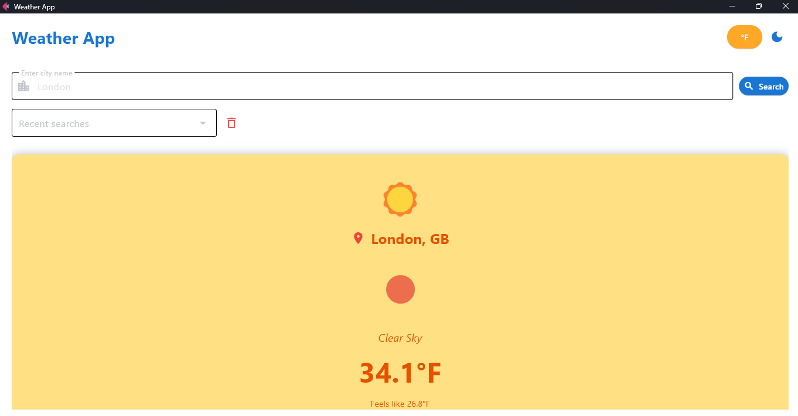
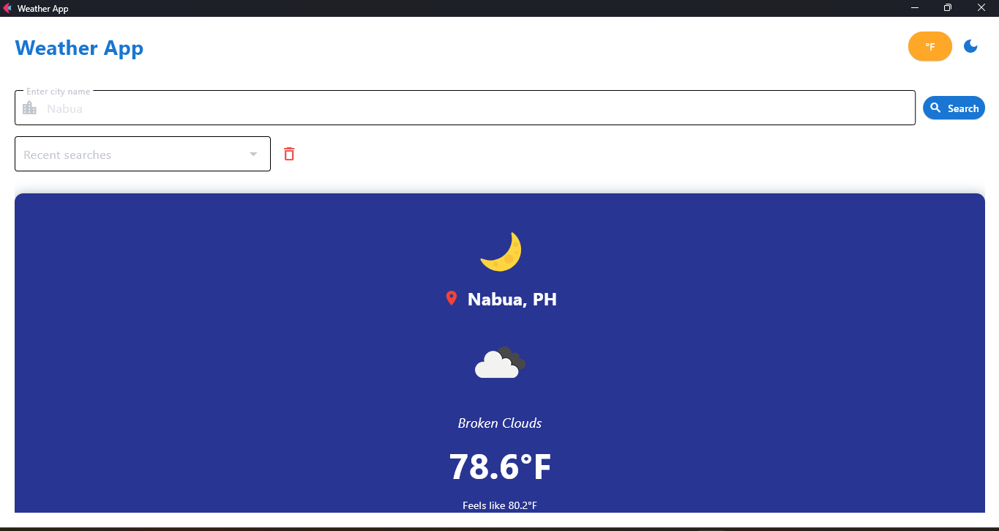
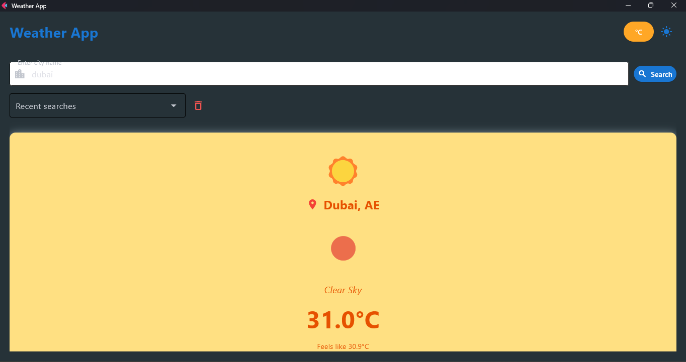
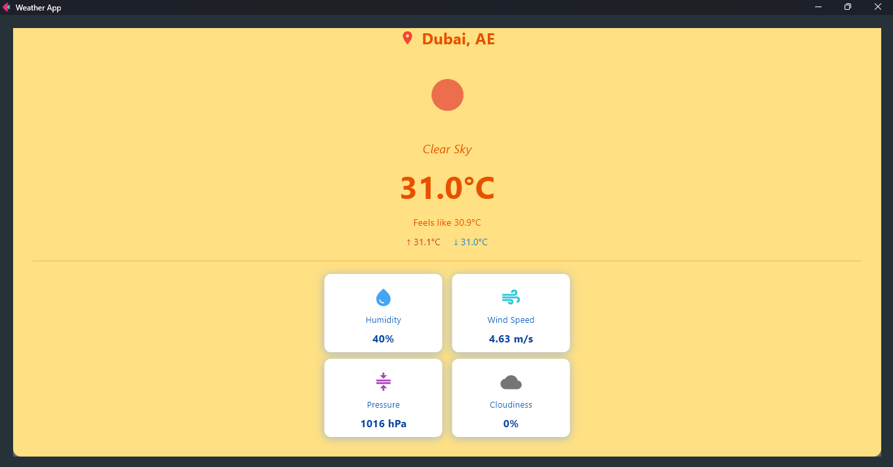
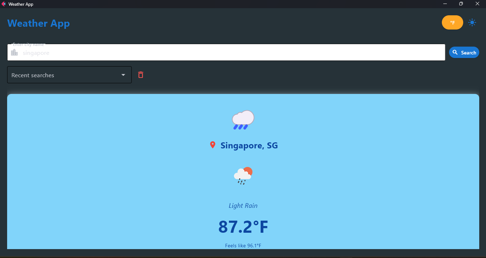
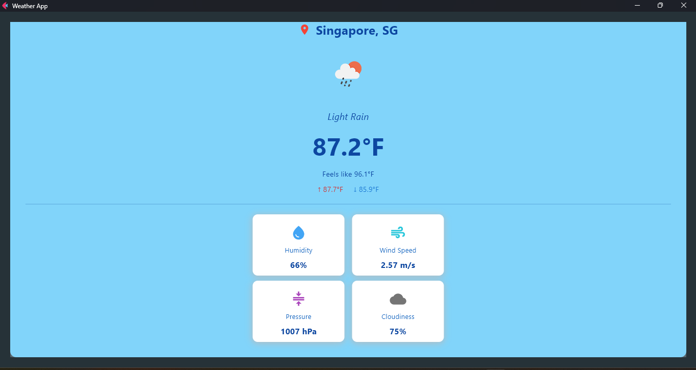

# Weather Application - Module 6 Lab

## Student Information
- **Name**: Ma.Francheska Recierdo
- **Student ID**: 231002338
- **Course**: CCCS 106
- **Section**: BSCS-3B

## Project Overview
A modern, feature-rich weather application built with Python and Flet framework. The app provides real-time weather information for any city worldwide, featuring a beautiful and intuitive user interface with dynamic color themes that change based on current weather conditions. Users can search for cities, view detailed weather metrics, toggle between temperature units (Celsius/Fahrenheit), and access their recent search history with persistent storage.


## Features Implemented

### Base Features
**City search functionality** 
  - Search any city worldwide using OpenWeatherMap API
**Current weather display** 
  - Shows real-time weather data with location details
**Temperature, humidity, wind speed** 
  Comprehensive weather metrics including:
  - Current temperature with feels-like temperature
  - Temperature range (min/max)
  - Humidity percentage
  - Wind speed in m/s
  - Atmospheric pressure in hPa
  - Cloudiness percentage
**Weather icons** 
  - Official OpenWeatherMap icons and custom emoji indicators
**Error handling** 
  - User-friendly error messages for:
  - City not found (404)
  - Invalid API key (401)
  - Network errors
  - Timeout errors
**Modern UI with Material Design** 
  - Clean, responsive interface with:
  - Material Design 3 principles
  - Smooth animations and transitions
  - Dark/Light theme toggle
  - Shadow effects and rounded corners

### Enhanced Features
#### 1. **Search History with Persistent Storage**

**Description:**
This feature maintains a history of the last 10 searched cities and stores them permanently in a JSON file (`search_history.json`). The history is displayed in a dropdown menu for quick access, and users can clear the entire history with a single click.

**Implementation Details:**
- Uses `HistoryManager` class to handle all history operations
- Stores data in `search_history.json` using Python's `json` module
- Most recent searches appear first (LIFO order)
- Automatically removes duplicates by moving repeated cities to the top
- Dropdown auto-populates on app startup
- Clear button appears only when history exists
- Dropdown resets to "Recent searches" after manual search

**Why I Chose This Feature:**
I chose this feature because it significantly improves user experience by:
1. Eliminating the need to retype frequently checked cities
2. Providing quick access to previously searched locations
3. Saving user data between sessions (persistence)
4. Making the app more practical for daily use

**Challenges Faced and Solutions:**

*Challenge 1:* Initially, the dropdown would still show the selected city name after manually searching for a new city.
- **Solution:** Added `self.history_dropdown.value = None` in the `get_weather()` method to reset the dropdown whenever a manual search is performed.

*Challenge 2:* Managing duplicate cities in the history list.
- **Solution:** Implemented logic to check if a city already exists in history and move it to the top rather than creating a duplicate entry.

*Challenge 3:* Ensuring the history persists across app sessions.
- **Solution:** Implemented file I/O operations with proper error handling to save/load history from a JSON file. Added try-except blocks to handle corrupted JSON files gracefully.

**Technical Implementation:**
```python
# Key methods in HistoryManager class:
- _load_history(): Loads history from JSON file on startup
- _save_history(): Saves history to JSON file after each change
- add_city(): Adds city to history (with duplicate handling)
- clear_history(): Clears all history and updates file
```

---

#### 2. **Temperature Unit Toggle (Celsius/Fahrenheit)**

**Description:**
Users can toggle between Celsius and Fahrenheit temperature units using a dedicated button in the top-right corner. The preference is saved and persists across sessions. When toggled, all temperature values (current, feels-like, min, max) instantly convert without re-fetching data from the API.

**Implementation Details:**
- Uses `PreferencesManager` class to handle user settings
- Stores preference in `user_preferences.json`
- Orange °C/°F button in the UI header
- Instant conversion without API calls
- All temperature values update simultaneously
- Preference loads automatically on app startup

**Why I Chose This Feature:**
I selected this feature because:
1. Different regions use different temperature scales (US uses Fahrenheit, most of the world uses Celsius)
2. It demonstrates understanding of data conversion and state management
3. It improves accessibility for international users
4. It shows how to persist user preferences
5. It's a practical feature that real weather apps have

**Challenges Faced and Solutions:**

*Challenge 1:* Converting temperatures without losing the original Celsius data from the API.
- **Solution:** Stored the original weather data in `self.current_weather_data` and performed conversions on-the-fly using `get_temp_display()` method. This allows instant toggling without re-fetching from API.

*Challenge 2:* Ensuring the preference persists between app sessions.
- **Solution:** Created `PreferencesManager` class similar to `HistoryManager`, which handles loading/saving preferences to a JSON file with proper error handling.

*Challenge 3:* Updating all temperature displays simultaneously when toggling.
- **Solution:** Used `page.run_task()` to call `display_weather()` with the stored weather data, which re-renders all temperature values in the new unit.

**Technical Implementation:**
```python
# Temperature conversion formula:
Fahrenheit = (Celsius × 9/5) + 32

# Key methods:
- celsius_to_fahrenheit(): Converts Celsius to Fahrenheit
- get_temp_display(): Returns formatted temperature string in selected unit
- toggle_temp_unit(): Switches unit and redisplays weather
```

---

#### 3. **Dynamic Weather-Based Color Themes**

**Description:**
The application's background and weather container colors dynamically change based on current weather conditions and time of day. Each weather type (sunny, rainy, cloudy, snowy, etc.) has a unique color palette with matching emoji indicators, creating an immersive and visually appealing experience.

**Implementation Details:**
- `get_weather_color_scheme()` method maps weather conditions to color schemes
- Detects day/night using OpenWeather icon codes (ending in 'd' or 'n')
- Smooth color transitions using Flet's animation system
- 8 different weather-based themes:
  - 🌙 **Night** - Dark indigo
  - ☀️ **Clear/Sunny** - Warm yellow/amber
  - ☁️ **Cloudy** - Cool grey
  - 🌧️ **Rain** - Light blue
  - ⛈️ **Thunderstorm** - Deep purple
  - ❄️ **Snow** - Cyan/white
  - 🌫️ **Fog/Mist** - Neutral grey
  - 🌤️ **Default** - Light blue

**Why I Chose This Feature:**
I implemented this feature because:
1. It makes the app more engaging and visually interesting
2. It provides instant visual feedback about weather conditions
3. It demonstrates advanced UI/UX design skills
4. It shows understanding of conditional styling
5. It creates a unique, memorable user experience
6. It goes beyond basic functionality to add aesthetic value

**Challenges Faced and Solutions:**

*Challenge 1:* Determining the right color combinations that are both aesthetically pleasing and accessible.
- **Solution:** Used Material Design color palettes (like `ft.Colors.AMBER_100`, `ft.Colors.INDIGO_900`) which are pre-tested for accessibility and visual harmony. Ensured sufficient contrast between background and text colors.

*Challenge 2:* Making colors transition smoothly rather than changing abruptly.
- **Solution:** Used Flet's animation system by adding `animate=ft.Animation(500, ft.AnimationCurve.EASE_IN_OUT)` to the weather container, creating smooth 500ms transitions.

*Challenge 3:* Handling edge cases and weather conditions not explicitly defined.
- **Solution:** Implemented a default color scheme that catches any undefined weather conditions, ensuring the app never breaks due to unexpected API responses.

*Challenge 4:* Maintaining readability with different background colors.
- **Solution:** Each color scheme includes a `text_color` property that ensures text remains visible. Light backgrounds use dark text, and dark backgrounds use light text.

**Technical Implementation:**
```python
# Color scheme structure:
{
    'bg': Background color for the page,
    'container': Background color for weather card,
    'emoji': Weather emoji indicator,
    'text_color': Text color for readability
}

# Detection logic:
- Checks weather_main (Clear, Clouds, Rain, etc.)
- Checks icon_code ending ('d' for day, 'n' for night)
- Returns matching color scheme dictionary
```

**Visual Impact:**
- Creates different moods based on weather
- Enhances user engagement
- Makes weather conditions immediately recognizable
- Adds professional polish to the application

---

## Screenshots








## Installation

### Prerequisites
- Python 3.8 or higher
- pip package manager

### Setup Instructions
```bash
# Clone the repository
git clone https://github.com/Maria-120904/cccs106-projects.git
cd cccs106-projects/mod6_labs

# Create virtual environment
python -m venv venv
source venv/bin/activate  # On Windows: venv\Scripts\activate

# Install dependencies
pip install -r requirements.txt

# Create .env file
cp .env.example .env
# Add your OpenWeatherMap API key to .env
echo OPENWEATHER_API_KEY=your_api_key_here > .env
echo OPENWEATHER_BASE_URL=https://api.openweathermap.org/data/2.5/weather >> .env
echo UNITS=metric >> .env
echo TIMEOUT=10 >> .env

# 5. Run the application
python main.py
```