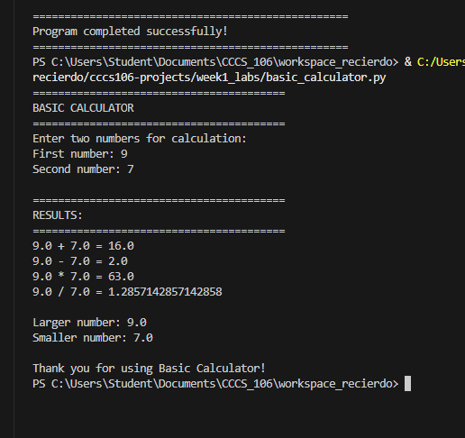
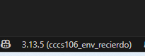
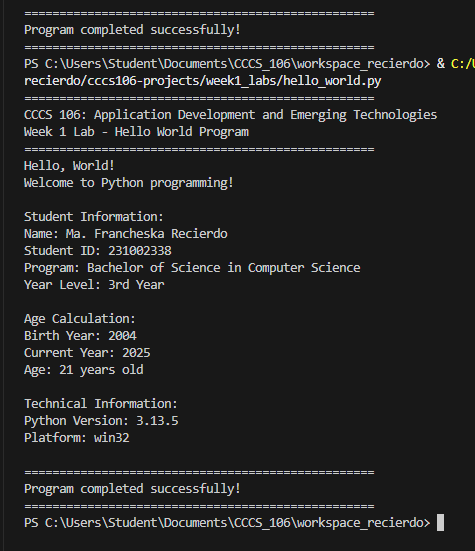
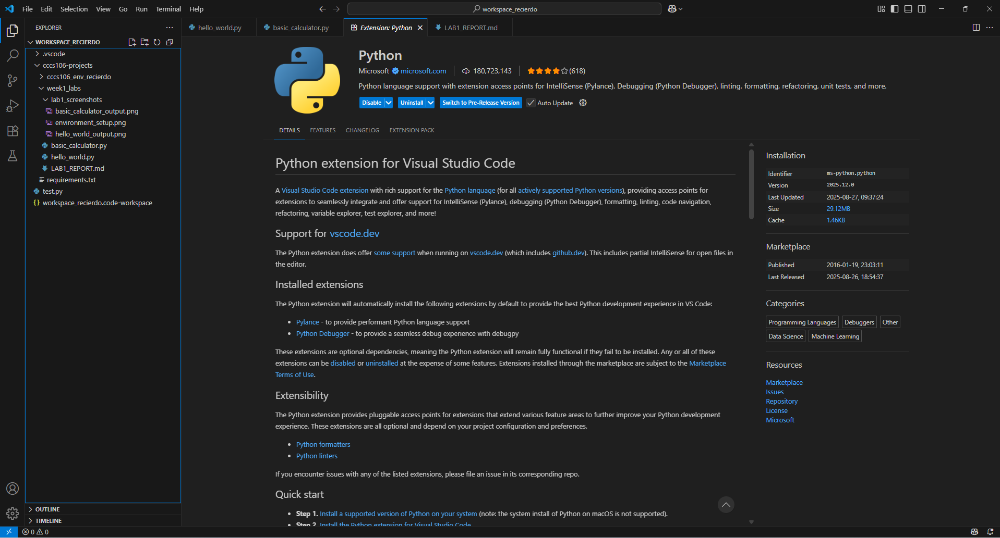

# Lab 1 Report: Environment Setup and Python Basics

**Student Name:** Ma. Francheska Recierdo
**Student ID:** 231002338
**Section:** BSCS3B
**Date:** 08/27/25

## Environment Setup

### Python Installation
- **Python Version:** [e.g., 3.13.5]
- **Installation Issues:** [Describe any problems and solutions]
- **Virtual Environment Created:** ✅ cccs106_env_recierdo

### VS Code Configuration
- **VS Code Version:** [e.g., 1.103.2]
- **Python Extension:** ✅ Installed and configured
- **Interpreter:** ✅ Set to cccs106_env_recierdo/Scripts/python.exe

### Package Installation
- **Flet Version:** 0.28.3
- **Other Packages:** [List any additional packages]

## Programs Created

### 1. hello_world.py
- **Status:** ✅ Completed
- **Features:** Student info display, age calculation, system info
- **Notes:** Change of Student name, Date, Student id, Birth year, Year level and program

### 2. basic_calculator.py
- **Status:** ✅ Completed
- **Features:** Basic arithmetic, error handling, min/max calculation
- **Notes:** N/A

## Challenges and Solutions

Challenge: Interpreter is not showing in VS code
Solution: Selecting the direct python interpreter file

## Learning Outcomes

I learned how to install python and set up or create a virtual environment
I understand how vs code workspace keep my project organized
I practice writing my first python program with input, output and basic error handling

## Screenshots

