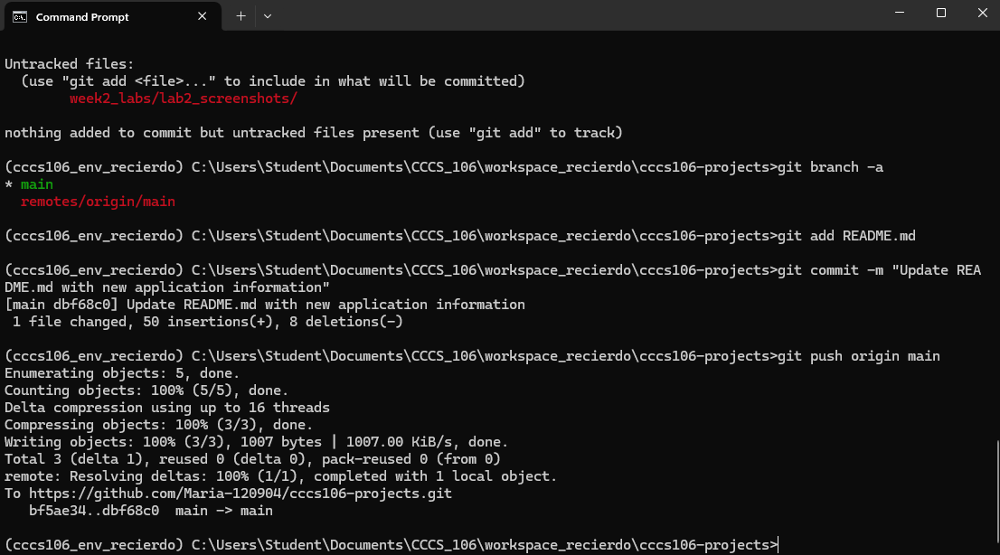

# Lab 2 Report: Git Version Control and Flet GUI Development

**Student Name:** Francheska Recierdo
**Student ID:** 231002338
**Section:** 3B
**Date:** 09/10/25

## Git Configuration

### Repository Setup
- **GitHub Repository:** https://github.com/Maria-120904/cccs106-projects
- **Local Repository:** ✅ Initialized and connected
- **Commit History:** [Number] commits with descriptive messages

### Git Skills Demonstrated
- ✅ Repository initialization and configuration
- ✅ Adding, committing, and pushing changes
- ✅ Branch creation and merging
- ✅ Remote repository management

## Flet GUI Applications

### 1. hello_flet.py
- **Status:** ✅ Completed
- **Features:** Interactive greeting, student info display, dialog boxes
- **UI Components:** Text, TextField, Buttons, Dialog, Containers
- **Notes:** N/A

### 2. personal_info_gui.py
- **Status:** ✅ Completed
- **Features:** Form inputs, dropdowns, radio buttons, profile generation
- **UI Components:** TextField, Dropdown, RadioGroup, Containers, Scrolling
- **Error Handling:** Input validation and user feedback
- **Notes:** N/A

## Technical Skills Developed

### Git Version Control
- Understanding of repository concepts
- Basic Git workflow (add, commit, push)
- Branch management and merging
- Remote repository collaboration

### Flet GUI Development
- Flet 0.28.3 syntax and components
- Page configuration and layout management
- Event handling and user interaction
- Modern UI design principles

## Challenges and Solutions

Challenge: Forgetting to stage files before committing.

Solution: Used git status frequently to verify changes and always staged with git add.

## Learning Outcomes

I learned how git helps in managing the versions of the project and also learned how important the commit messages.

I understand now how to use breaches in Git to safely add new features without breaking the main code.

I became more familiar in creating simple GUI applications using flet and handing the user input effectively.

This Exercise improved my knowledge in using both version control and GUI frameworks together in a real project workflow. 

## Screenshots

### Git Repository
- [ ] GitHub repository with commit history
- [ ] Local git log showing commits

### GUI Applications
- [ ] hello_flet.py running with all features
- [ ] personal_info_gui.py with filled form and generated profile

## Future Enhancements

[Ideas for improving the applications or additional features to implement]